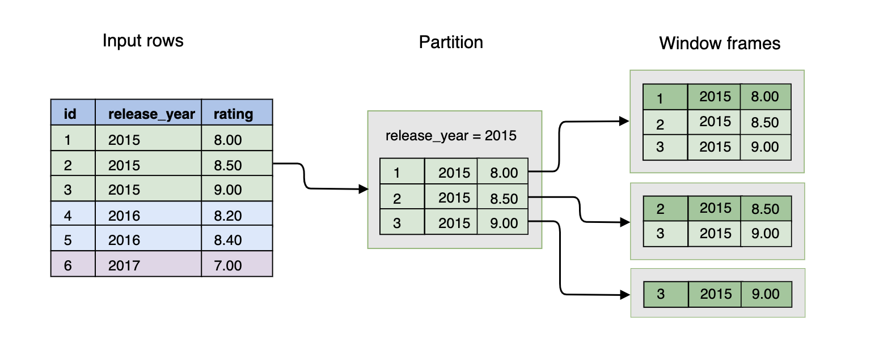

# Windowing Functions

A window function operates on a group ("window") of related rows.

Each time a window function is called, it is passed a row (the current row in the window) and the window of rows that contain the current row. The window function returns one output row for each input row. The output depends on the individual row passed to the function and the values of the other rows in the window passed to the function. 

## First Example

Let us have the table `films` given with the following schema:
| PK |   name       |  type   |
|----|--------------|---------|
| yes | id           | Integer |
| no  | release_year | Integer |
| no   | rating       | Numeric |

and the following example data:

| id |  release_year  | rating |
|----|----------------|--------|
|  1 |   2015         | 8.00  |
|  2 |   2015         | 8.50   |
|  3 |   2015         | 9.00  |
|  4 |   2016         | 8.20  |
|  5 |   2016         | 8.40  |
|  6 |   2017         | 7.00  |

*First Question*: For each film find the average rating of all films in its release year.

Using `AVG` as a window function we write:

```sql
SELECT
 f.id, f.release_year, f.rating,
 AVG(rating) OVER (PARTITION BY release_year) AS year_avg
    FROM films f ORDER BY release_year, rating;
```
This will result in the following 

| id  | release_year  | rating  | year_avg  |
|-----|---------------|---------|-----------|
|  1  |   2015        |  8.00   |  8.50     |
|  2  |   2015        |  8.50   |  8.50     |
|  3  |   2015        |  9.00   |  8.50     |
|  4  |   2016        |  8.20   | 8.30      |
| 5   |   2016        |  8.40   | 8.30      |
|  6  |   2017        |  7.00   | 7.00      |

*Second Question*: For each film find an average rating of all strictly better films in its release year.

It is clear that we need to divide the rows into `release_year` partitions. But the calculation of average needs to be done only on a subset of a partition.
The subset needs to be different for every row - we need to consider rows that have a greater value in the `rating` column only. 

Here come the Window Frames..

Window frames are a feature which allows dividing partitions into smaller subsets. These subsets can differ from a row to row. This is something that can't be achieved with partitioning only. For example, we can have window frames that contain all the rows with the same or greater value in a given column

\
Figure 1: Window frames mechanism


| id  | release_year  | rating  | avg_of_better |
|-----|---------------|---------|---------------|
|  1  |   2015        |  8.00   |  8.75         |
|  2  |   2015        |  8.50   |  9.00         |
|  3  |   2015        |  9.00   |  [NULL]       |
|  4  |   2016        |  8.20   |  8.40         |
| 5   |   2016        |  8.40   |  [NULL]       |
|  6  |   2017        |  7.00   |  [NULL]       |


