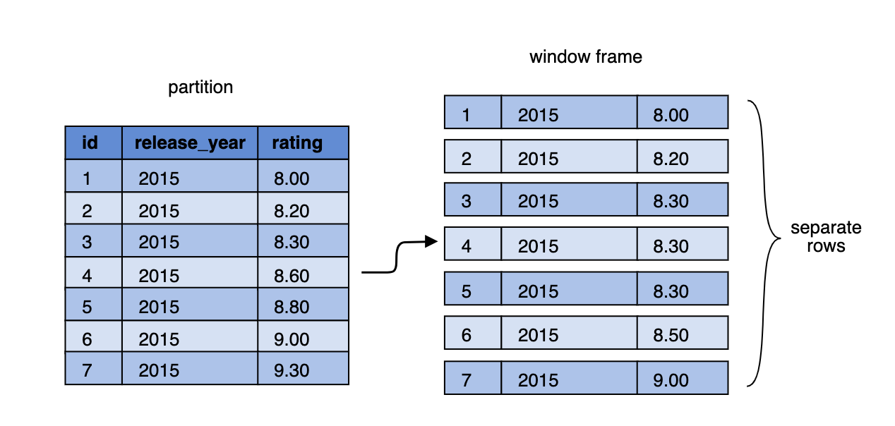
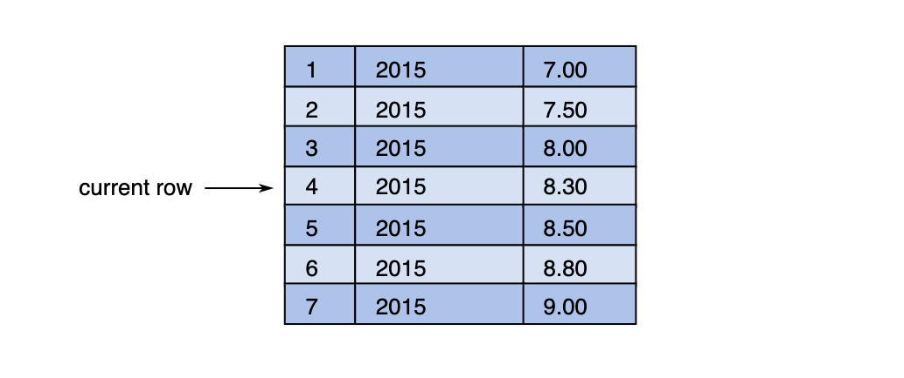
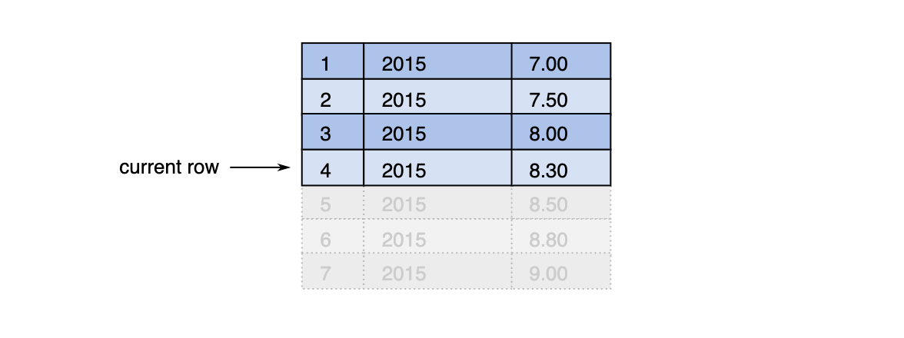
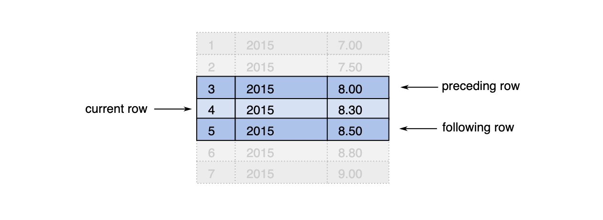

# Windowing Functions

A window function operates on a group ("window") of related rows.

Each time a window function is called, it is passed a row (the current row in the window) and the window of rows that contain the current row. The window function returns one output row for each input row. The output depends on the individual row passed to the function and the values of the other rows in the window passed to the function. 

## First Example

Let us have the table `films` given with the following schema:
| PK |   name       |  type   |
|----|--------------|---------|
| yes | id           | Integer |
| no  | release_year | Integer |
| no   | rating       | Numeric |

and the following example data:

| id |  release_year  | rating |
|----|----------------|--------|
|  1 |   2015         | 8.00  |
|  2 |   2015         | 8.50   |
|  3 |   2015         | 9.00  |
|  4 |   2016         | 8.20  |
|  5 |   2016         | 8.40  |
|  6 |   2017         | 7.00  |

*First Question*: For each film find the average rating of all films in its release year.

Using `AVG` as a window function we write:

```sql
SELECT
 f.id, f.release_year, f.rating,
 AVG(rating) OVER (PARTITION BY release_year) AS year_avg
    FROM films f ORDER BY release_year, rating;
```
This will result in the following 

| id  | release_year  | rating  | year_avg  |
|-----|---------------|---------|-----------|
|  1  |   2015        |  8.00   |  8.50     |
|  2  |   2015        |  8.50   |  8.50     |
|  3  |   2015        |  9.00   |  8.50     |
|  4  |   2016        |  8.20   | 8.30      |
| 5   |   2016        |  8.40   | 8.30      |
|  6  |   2017        |  7.00   | 7.00      |

*Second Question*: For each film find an average rating of all strictly better films in its release year.

It is clear that we need to divide the rows into `release_year` partitions. But the calculation of average needs to be done only on a subset of a partition.
The subset needs to be different for every row - we need to consider rows that have a greater value in the `rating` column only. 

Here come the Window Frames..

Window frames are a feature which allows dividing partitions into smaller subsets. These subsets can differ from a row to row. This is something that can't be achieved with partitioning only. For example, we can have window frames that contain all the rows with the same or greater value in a given column

\
Figure 1: Window frames mechanism

| id  | release_year  | rating  | avg_of_better |
|-----|---------------|---------|---------------|
|  1  |   2015        |  8.00   |  8.75         |
|  2  |   2015        |  8.50   |  9.00         |
|  3  |   2015        |  9.00   |  [NULL]       |
|  4  |   2016        |  8.20   |  8.40         |
| 5   |   2016        |  8.40   |  [NULL]       |
|  6  |   2017        |  7.00   |  [NULL]       |

But how to specify which rows should be included in window frames. 

## Syntax of window functions
 General simplified forma of a window function invocation:

```sql
function_name OVER (PARTITION BY ... ORDER BY ... frame_clause)
```

`frame_clause` is the part that defines window frames, It looks as follows:

```sql
mode BETWEEN frame_start AND frame_end [ frame_exclusion ]
```

In the last syntax 

* **mode** sets the way a database engine treats input rows. There are three possible values: `ROWS`, `GROUPS` and `RANGE`.
* **frame_start** and **frame_end** define where a window frame starts and where it ends
* **frame_exclusion** can be used to specify parts of a window frame that have to be excluded from the calculations.

*Note*: window frames are constructed for every single input row separately, their content may differ from row to row. It is essential to consider a window frame with regard to the row that the frame is built for. That row will be denoted as **the current row**.
It is important to specify the order in which rows appear in a window frame. The order in which rows appear in a window frame must be specified precisely. In most cases the exact position of the current row compared to other rows will have direct impact on the content of a frame. In order to achieve this usually we want to have the rows sorted consistently - this can be done by the clause `ORDER BY` added to the window function call.

In the current example the rows have been sorted by the `rating` column in ascending order. The simple data set has been modifed to contain films released in a single year only.

## Window frame modes

### Rows mode

The `ROWS` mode is the simplest one. It instructs the DB to treat each input row separately, as inidividual entities.

\
Figure 2: *ROWS* mode

In the `ROWS` mode *frame_start* and *frame_end* allow us to specify which rows the window frame starts and ends with. They accept the following values:

* `UNBOUNDED PRECEDING` - (possible only in *frame_start*) start wih the first row of the partition
* `offset PRECEDING` - start/end with a given number of rows before the current row
* `CURRENT ROW` - start/end with the current row
* `offset FOLLOWING` - start/end with a given number number of rows after the current row
* `UNBOUNDED FOLLOWING` - (possible only as a *frame_end*) end with the last row of the partition

*Note*: when designing queries with window function using window frame always ask yourself which row is the current row because different rows in the frame may appear quite differently. All of the figures below present how the frame looks like for asingle chosen input row.

Let us consider a do-nothing window frame syntax which simply selects all rows from the beginning of the partition to the end:

```sql
ROWS BETWEEN UNBOUNDED PRECEDING AND UNBOUNDED FOLLOWING
```

\
Figure 3: individual rows for the modified example dataset with current row indicator

Now we will do something more interesting with the modified dataset - we will start with the beginning of the partition, but end with the current row. This is where the order of rows begins to matter:

```sql
ROWS BETWEEN UNBOUNDED PRECEDING AND CURRENT ROW
```
\
Figure 4: unbounded preceding to current row with the modified example dataset

With the next syntax we start with the first row before the current row and end with the first row after the current row:

```sql
ROWS BETWEEN 1 PRECEEDING AND 1 FOLLOWING
```
\
Figure 5: one row preceding and one row fillowing the current rwo with the modified example dataset

